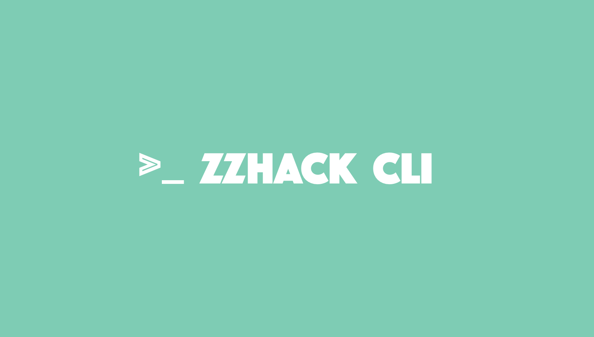

[English](https://github.com/zzhack-stack/zzhack-cli/blob/main/README.md) | 中文文档

`zzhack-cli` 是一个可以帮助你快速生成 [WASM](https://webassembly.org/) WebApp 的命令行工具，不需要一行代码只需要简单的配置即可。值得一提的是 `zzhack-cli` 的 UI 模板来自于 [zzhack](https://github.com/zzhack-stack/zzhack)，你可以直接访问 [Live Demo](https://www.zzhack.fun/) 来获得更真实的体验。

## 快速开始
[zzhack](https://github.com/zzhack-stack/zzhack) 是用 Rust 编写的，因此你需要准备 Rust 的开发环境，以此来获得一些我们会用到的其他的命令行工具，比如 `trunk`, `zzhack` 等，你可以访问 [Rust Book](https://doc.rust-lang.org/cargo/getting-started/installation.html) 或者 [rust-lang.org](https://www.rust-lang.org/) 来了解更多。

在你拥有了 [Rust](https://www.rust-lang.org/) 的开发环境之后，你还需要一些命令行工具来帮助你构建。复制下面的命令到你的终端来安装它们。

```sh
rustup target add wasm32-unknown-unknown
cargo install trunk zzhack
```

现在！让我们启动你的第一个 WASM WebApp 吧！

```sh
# Create project workspace
mkdir my-first-wasm-project

cd my-first-wasm-project

# Init zzhack project & serve
zzhack init
zzhack serve
```

## 文档
你可以使用 `zzhack init` 来获取 zzhack 的默认配置来获取更多的文档细节。

## 许可
MIT.